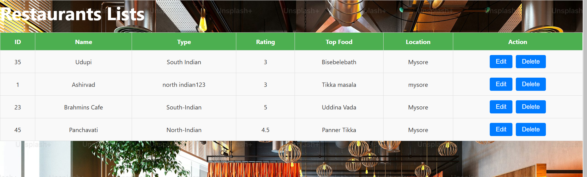
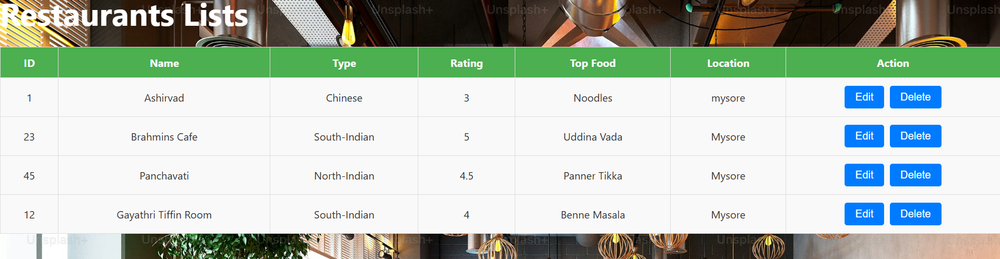

# Restaurant Management Application

This is a full-stack web application for managing restaurant records. The application is built using React for the frontend and Node.js with Express and MongoDB for the backend. It allows users to create, read, update, and delete restaurant records.

## Features

- View a list of restaurants
- Add a new restaurant record
- Update existing restaurant records
- Delete restaurant records

## Tech Stack

- **Frontend**: React
- **Backend**: Node.js, Express
- **Database**: MongoDB
- **HTTP Client**: Axios

## Getting Started

### Prerequisites

- Node.js (v12 or higher)
- MongoDB (local or a cloud instance)
- npm (Node Package Manager)

## Usage

1. Open your browser and go to `http://localhost:3000`.
2. You will see the list of restaurants.
3. To add a new restaurant, fill in the form at the bottom and click **"Add Record"**.
4. To edit an existing restaurant, click the **"Edit"** button next to the restaurant you want to modify.
5. To delete a restaurant, click the **"Delete"** button next to the restaurant.

## API Endpoints

- **GET** `/getAllMenus` - Fetch all restaurant records.
- **POST** `/insertData` - Add a new restaurant record.
- **PUT** `/updateRestaurant/:id` - Update an existing restaurant record by ID.
- **DELETE** `/deleteRecord/:id` - Delete a restaurant record by ID.

# Restaurant Management System

## Screenshots

- **General Restaurant Management UI**  
  This is the main interface for managing restaurants within the system. It provides options to add, update, and delete restaurants, as well as view the list of existing restaurants.  
  

- **Listing All Restaurants**  
  This screen displays a list of all the restaurants managed within the system. Each restaurant is shown with basic details such as name, location, and status.  
  

### Inserting a Restaurant

- **Adding Restaurant Information (Step 1)**  
  In this screen, users can enter the initial details of a new restaurant, including name, location, and type of cuisine.  
  

- **Adding Restaurant Information (Step 2)**  
  We can see that the restaurant is added to our list.  
  

### Updating Restaurant Info

- **Updating Restaurant Information (Step 1)**  
  This UI allows users to edit the information of an existing restaurant, such as updating the name, location, or rating.  
  

- **Updating Restaurant Information (Step 2)**  
  We can see that the information about the restaurant is updated.  
  

### Deleting a Restaurant

- **Deleting a Restaurant (Step 1)**  
  This screen is used to initiate the deletion of a restaurant. Users can select a restaurant to remove from the system.  
  

- **Deleting a Restaurant (Step 2)**  
  We can see that the restaurant has been removed from our list.  
  
